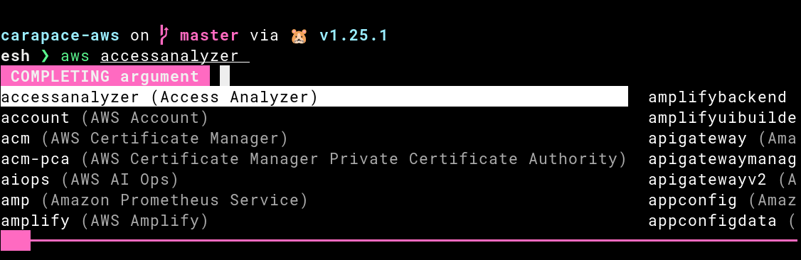

# carapace-aws

Carapace-aws is an enriched completer for [aws-cli].

## Getting Started

With [carapace-bin] `carapace-aws` is implicitly used when the binary is in [PATH].

Otherwise [source](https://carapace-sh.github.io/carapace/carapace/gen.html#hidden-subcommand) the output of `carapace-aws _carapace`.

## How it works

The subcommands in [aws-cli] are mostly based on the [botocore] service definitions.
Which are `json` files that contain additional information and static completions.
But these are not fully exposed to the shell and only accessible in [auto-prompt].

Carapace-aws parses the [botocore] service definitions into a [carapace] based completer.
This enables support for descriptions, colored hightlighting, and custom completions.
Undefined completions are then simply delegated to the official [aws_completer].

[auto-prompt]:https://docs.aws.amazon.com/cli/latest/userguide/cli-usage-parameters-prompting.html
[aws-cli]:https://github.com/aws/aws-cli
[aws_completer]:https://docs.aws.amazon.com/cli/latest/userguide/cli-configure-completion.html
[botocore]:https://github.com/boto/botocore
[carapace-bin]:https://github.com/carapace-sh/carapace-bin
[carapace]:https://carapace.sh
[PATH]:https://en.wikipedia.org/wiki/PATH_(variable)
